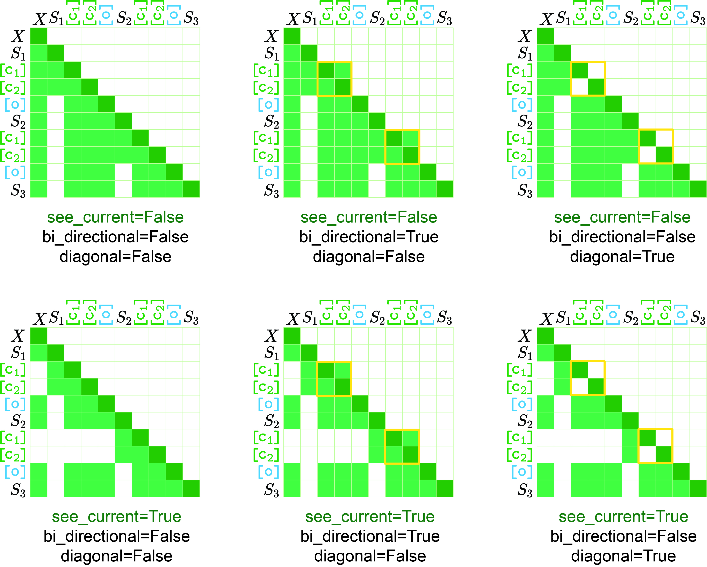

# Training Scripts

+ `model_type`
    - **Description:** Refers to the type of the current training model. Currently, only `qwen` and `llama` are supported.
    - **Type:** str
+ `tokenizer_path`
    - **Description:** Path to the tokenizer.
    - **Type:** str
+ `model_path`
    - **Description:** Path to the model.
    - **Type:** str
+ `bos_token`
    - **Description:** The beginning token corresponding to the model. For `qwen`, the value is `<|im_start|>`; for `llama`, the value is `<|begin_of_text|>`.
    - **Type:** str
+ `eos_token`
    - **Description:** The ending token corresponding to the model. For `qwen`, the value is `<|im_end|>`; for `llama`, the value is `<|eot_id|>`.
    - **Type:** str
+ `conf_version`
    - **Description:** The name of the configuration file, located at `configs/LightThinker/{model_type}/{conf_version}.json`.
    - **Type:** str
+ `max_length`
    - **Description:** Maximum training length.
    - **Type:** int
+ `lr_schedule_type`
    - **Description:** Learning rate scheduler, with optional values being `linear` and `cosine`. Refer to [here](https://huggingface.co/docs/transformers/en/main_classes/optimizer_schedules#transformers.SchedulerType) for more details.
    - **Type:** str
+ `epochs`
    - **Description:** Number of training epochs.
    - **Type:** int
+ `lr`
    - **Description:** Learning rate.
    - **Type:** float
+ `save_steps`
    - **Description:** This parameter will not be used.
    - **Type:** int
+ `deepspeed`
    - **Description:** Path to the deepspeed configuration file.
    - **Type:** str
+ `micro_batch_size`
    - **Description:** Batch size per GPU.
    - **Type:** int
+ `gradient_accumulation_steps`
    - **Description:** Gradient accumulation steps.
    - **Type:** int
+ `warmup_ratio`
    - **Description:** Warmup ratio. Refer to [here](https://huggingface.co/docs/transformers/en/main_classes/trainer#transformers.TrainingArguments.warmup_ratio) for more details.
    - **Type:** float
+ `warmup_steps`
    - **Description:** Warmup steps. Refer to [here](https://huggingface.co/docs/transformers/en/main_classes/trainer#transformers.TrainingArguments.warmup_steps) for more details.
    - **Type:** int
+ `mode`
    - **Description:** Indicates the training data mode. A total of 4 different modes are provided:
        * `normal`: Indicates no compression is needed, directly using the most normal data for training, corresponding to vanilla.
        * `aug`: Indicates compression is needed, and the compression includes the prompt part.
        * `aug-wo-pc`: Indicates compression is needed, but the prompt part does not need to be compressed. This is the implementation of the paper and is recommended.
        * `recover`: Indicates compression is needed, and introduces a `recover token` to add an additional auxiliary loss, meaning the model recovers the original text from the compressed content.
    - **Type:** str
+ `model_size`
    - **Description:** Used to identify the folder when saving, can be empty.
    - **Type:** str
+ `init_tag`
    - **Description:** Used to identify the folder when saving, can be empty.
    - **Type:** str
+ `train_path`
    - **Description:** Path to the training file.
    - **Type:** str
+ `see_current`
    - **Description:** Optional values are `true` or `false`. Refer to the figure below.
    - **Type:** str
+ `bi_directional`
    - **Description:** Optional values are `true` or `false`. Refer to the figure below.
    - **Type:** str
+ `diagnonal`
    - **Description:** Optional values are `true` or `false`. Refer to the figure below.
    - **Type:** str
+ `exclude_continue`
    - **Description:** This parameter will not be used.
    - **Type:** str
+ `qkv`
    - **Description:** This parameter will not be used.
    - **Type:** str
+ `freeze_model`
    - **Description:** This parameter will not be used.
    - **Type:** str
+ `train_on_input`
    - **Description:** Indicates whether the prompt part should participate in the loss calculation. It is recommended to set it to `false`.
    - **Type:** str
+ `hybrid`
    - **Description:** This is mainly effective when the `mode` is `aug` or `recover`, because the prompt in these two modes needs to be compressed. When `hybrid` is set to `true`, it means the prompt part will also be included in the recovery loss; when `hybrid` is set to `false`, the prompt part will not be included in the recovery loss.
    - **Type:** str
+ `output_compress_instruction`
    - **Description:** This parameter is a prompt, which will be added before the cache token. For example, `{previous_content} {output_compress_instruction} [c][c][o]`.
    - **Type:** str
+ `prefill_compress`
    - **Description:** This parameter indicates whether a full lower triangular matrix is used when compressing the prompt. Optional values are `true` or `false`.
    - **Type:** str

# Inference Scripts

- model_tag
  - **Description:** model_tag is the filename under the `output/` folder, corresponding to line 1461 of the code in `LightThinker/inference.py`. We will load the model from `output/{model_tag}/checkpoint-{args.ckpt}`.
  - **Type:** str
- model_short_tag
  - **Description:** model_short_tag is used to save files, corresponding to line 1691 of the code in `LightThinker/inference.py.`
  - **Type:** str
- model_type
  - **Description:** Refers to the type of the current training model. Currently, only `qwen` and `llama` are supported.
  - **Type:** str
- tokenizer_path
  - **Description:** Path to the tokenizer.
  - **Type:** str
- bos_token
  - **Description:** The beginning token corresponding to the model. For `qwen`, the value is `<|im_start|>`; for `llama`, the value is `<|begin_of_text|>`.
  - **Type:** str
- eos_token
  - **Description:** The ending token corresponding to the model. For `qwen,` the value is `<|im_end|>`; for `llama`, the value is `<|eot_id|>`.
  - **Type:** str
- compress_config
  - **Description:** Path to the config file.
  - **Type:** str
- ckpt
  - **Description:** We will load the model from `output/{model_tag}/checkpoint-{args.ckpt}`.
  - **Type:** int
- output_tag
  - **Description:** Used to identify the folder when saving the file.
  - **Type:** str
- model_path
  - **Description:** If you set the `model_path`, the arguments `ckpt` and `model_tag` will be ignored. See line 1460 of the code in LightThinker/inference.py for more details.
  - **Type:** str
- max_new_tokens
  - **Description:** Maximum number of tokens to generate.
  - **Type:** int
- root_dir
  - **Description:** The root directory of LightThinker.
  - **Type:** str
- prefix
  - **Description:** Used to identify the folder when saving, can be empty.
  - **Type:** str
- diagonal
  - **Description:** Optional values are `true` or `false`. Refer to the figure above.
  - **Type:** str
- see_current
  - **Description:** Optional values are `true` or `false`. Refer to the figure above.
  - **Type:** str
- compress_prompt
  - **Description:** Whether to compress the prompt, needs to be configured the same as during training. The optional values are true or false. In our experiments, it is false.
  - **Type:** str
- rolling_rope
  - **Description:** Whether to offset position_ids. The optional values are true or false.
  - **Type:** str
- bi_directional
  - **Description:** Optional values are `true` or `false`. Refer to the figure above.
  - **Type:** str
- exclude_continue
  - **Description:** This parameter will not be used.
  - **Type:** str
- output_compress_instruction
  - **Description:** This parameter is a prompt, which will be added before the cache token. For example, `{previous_content} {output_compress_instruction} [c][c][o]`.
  - **Type:** str
- prefill_compress 
  - **Description:** This parameter indicates whether a full lower triangular matrix is used when compressing the prompt. Optional values are `true` or `false`.
  - **Type:** str
- update_attention_method
  - **Description:** Optional values are local or global. The main difference lies in the calculation method of the attention mask each time. For global, the global attention mask needs to be obtained first and then cropped; for local, the passed-in attention mask is calculated directly. In our experiments, global is used for debugging, local is used for the inference process.
  - **Type:** str
- split_size
  - **Description:** Whether to split the current test set. A value of 1 means no splitting; a value of n means splitting into n parts.
  - **Type:** int
- index
  - **Description:** Used in conjunction with split_size. If splitting is done, index indicates which part of the split data is used for testing.
  - **Type:** int